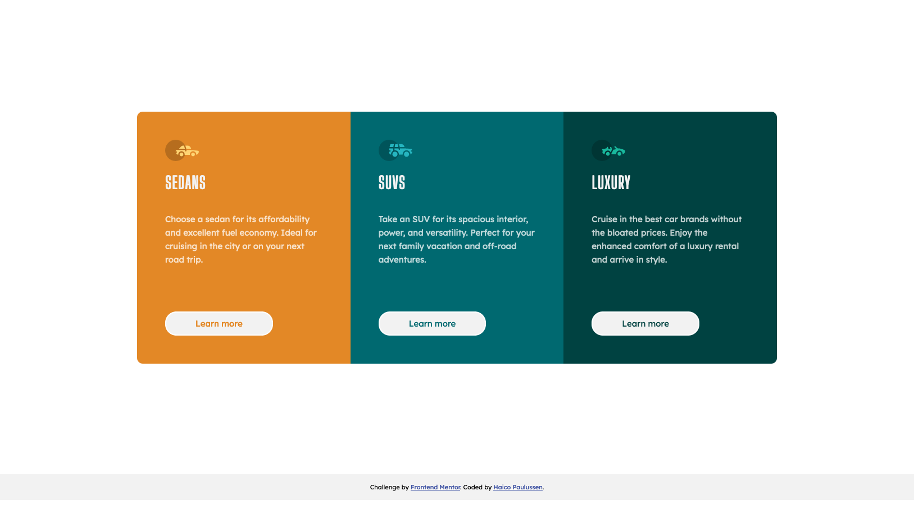

# Frontend Mentor - 3-column preview card component solution

This is a solution to the [3-column preview card component challenge on Frontend Mentor](https://www.frontendmentor.io/challenges/3column-preview-card-component-pH92eAR2-). Frontend Mentor challenges help you improve your coding skills by building realistic projects. 

## Table of contents

- [Overview](#overview)
  - [The challenge](#the-challenge)
  - [Screenshot](#screenshot)
  - [Links](#links)
- [My process](#my-process)
  - [Built with](#built-with)
  - [What I learned](#what-i-learned)
- [Author](#author)


## Overview

### The challenge

Your challenge is to build out this 3-column preview card component and get it looking as close to the design as possible.

You can use any tools you like to help you complete the challenge. So if you've got something you'd like to practice, feel free to give it a go.

Your users should be able to:

- View the optimal layout depending on their device's screen size
- See hover states for interactive elements

### Screenshot



### Links

- Solution URL: [My Frontend Mentor solution](https://www.frontendmentor.io/solutions/responsive-column-cards-with-css-flexbox-and-firstlastchild-nZGvT4dWO)
- Live Site URL: [Github Pages](https://haico-paulussen.github.io/column-preview-card/index.html)

## My process

### Built with

- HTML5
- CSS3 
- Flexbox

### What I learned

This time I learned the very basics of Flexbox. It's very usefull for challenges like this to position them correctly on a responsive screen. Also this is the first time I used @media to dictate how the layout should behave on different viewports.   

Code snippets i'm proud of:

```css
@media (max-width: 1000px) {
    main {
        flex-direction: column;
    }

    .card:first-child {
        border-top-left-radius: 10px;
        border-top-right-radius: 10px;
    }

    .card:last-child {
        border-bottom-left-radius: 10px;
        border-bottom-right-radius: 10px;
    }
}

@media (width > 1000px) {
    .card:first-child {
        border-top-left-radius: 10px;
        border-bottom-left-radius: 10px;
    }

    .card:last-child {
        border-top-right-radius: 10px;
        border-bottom-right-radius: 10px;
    }
}

.card {
    padding: 50px;
    display: flex;
    flex-direction: column;
    flex: 1;
}
```

### Continued development

I've now started with Flexbox. With the help of some tutorials I want to make my next challenge again with Flexbox. The next step after that is getting to know CSS Grid. 

Long term speaking, I want to (re-)learn JavaScript; Vue.js, nuxt.js and maybe other framworks.

## Author

- Frontend Mentor - [@Haico-Paulussen](https://www.frontendmentor.io/profile/Haico-Paulussen)
- LinkedIn - [Haico Paulussen](https://www.linkedin.com/in/haico-paulussen-160281158/)
